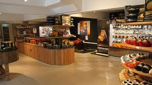
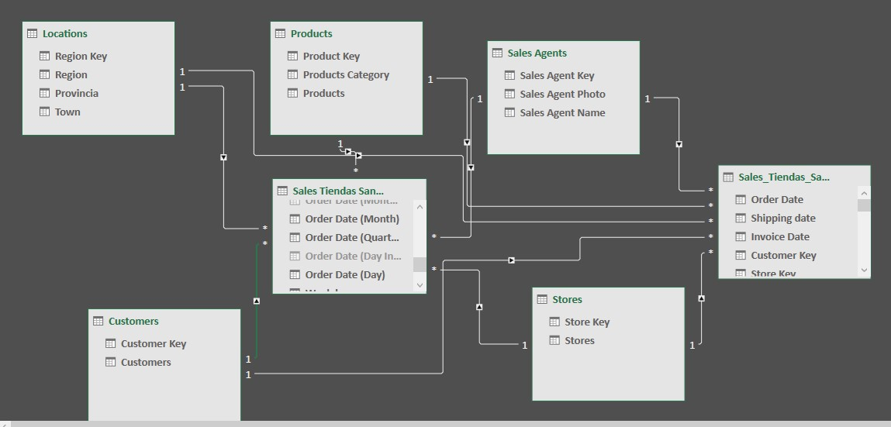
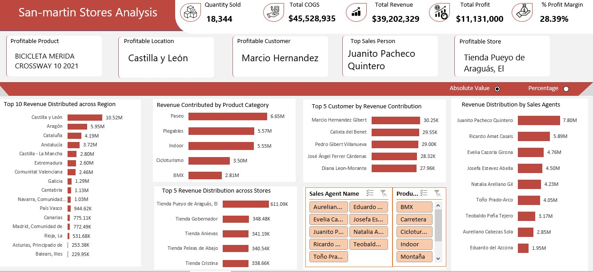
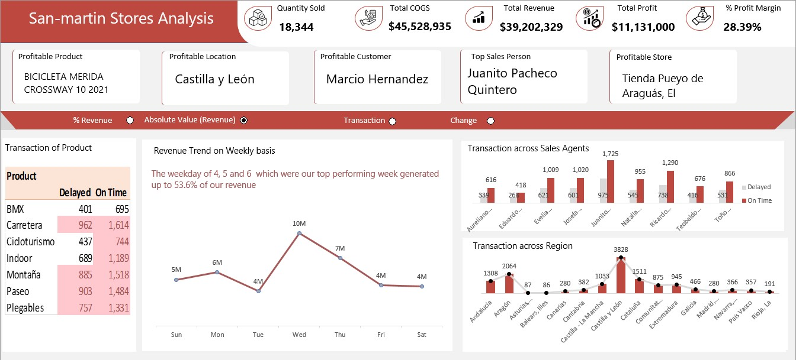

# San-Martin Stores Analysis 

### Introduction

San-Martin Stores is a retail company specializing in a wide range of products, with a focus on bicycles and related accessories. The company operates across various regions in Spain, with numerous stores contributing to the overall revenue. This analysis aims to provide insights into the sales performance, profitability, and operational efficiency of San-Martin Stores by leveraging a comprehensive dataset from 2021.

This analysis is crucial for identifying key areas of strength, such as top-performing products, regions, and sales agents, as well as uncovering potential areas for improvement, such as transaction delays and underperforming categories or regions.

### Tools Used

The analysis was performed using Microsoft Excel, a powerful tool for data analysis and visualization. Excel was utilized to clean the dataset, perform calculations, and create the visual dashboards that summarize the key performance metrics of San-Martin Stores. The dashboards were designed to be interactive, allowing for an in-depth exploration of the data and insights.
Modelling was a star schema 

### Statement of Problem

San-Martin Stores is experiencing variability in sales performance across different regions, product categories, and sales agents. Despite overall profitability, the company faces challenges, including:
- **Inconsistent Regional Performance**: Significant revenue disparities between regions, with Castilla y León outperforming others by a large margin.
- **Transaction Delays**: A noticeable number of delayed transactions in certain product categories, particularly BMX, which could impact customer satisfaction.
- **Uneven Sales Agent Performance**: A wide gap in performance between top and lower-tier sales agents, indicating potential inefficiencies or gaps in sales training.
The objective of this analysis is to:
1. Identify the top-performing products, regions, and sales agents.
2. Understand the causes of transaction delays and recommend solutions.
3. Provide actionable recommendations to improve overall sales and operational efficiency.

### Visualization

### Analysis and Insights

#### 1. **Revenue Distribution Across Regions**
   - **Insight**: Castilla y León is the highest revenue-generating region, contributing 26.8% of the total revenue, followed by Aragón (15.2%) and Cataluña (10.7%). The lowest contributors include regions like Asturias, Principado de, and Baleares, Illes.
   - **Recommendation**: Investigate the factors contributing to the success of Castilla y León and Aragón and replicate successful strategies in underperforming regions to boost overall revenue.

#### 2. **Revenue Contribution by Product Category**
   - **Insight**: The "Paseo" category is the top revenue generator, contributing 17.7%, followed by "Plegables" and "Indoor," each contributing 14.2% of the revenue. However, "BMX" has the lowest contribution at 7.2%.
   - **Recommendation**: Consider promoting or marketing the BMX category more aggressively to improve its sales or analyze customer preferences to understand the low performance in this category.

#### 3. **Top 5 Customers by Revenue Contribution**
   - **Insight**: The top customer, Marcio Hernandez Gibert, contributed $30.25K to the total revenue, followed closely by Calixte del Benet and Pedro Gibert Villanueva.
   - **Recommendation**: Develop a loyalty program or exclusive offers for these top customers to maintain and potentially increase their purchasing behavior.

#### 4. **Sales Agent Performance**
   - **Insight**: Juanito Pacheco Quintero is the top-performing sales agent, generating $7.80M in revenue, while the lowest-performing agents are Aureliano Cabezas Sola and Eduardo del Azcona.
   - **Recommendation**: Provide additional training and support to lower-performing sales agents to help them improve their sales figures. Consider setting up a mentorship program where top performers can share strategies with others.

#### 5. **Transaction Delays by Product Category**
   - **Insight**: The "Montaña" and "Paseo" categories have the highest number of delayed transactions, with 885 and 903 delayed orders, respectively.
   - **Recommendation**: Conduct a root cause analysis to understand why these categories are experiencing delays. Addressing supply chain or logistic issues could reduce delays and improve customer satisfaction.

#### 6. **Revenue Trends on a Weekly Basis**
   - **Insight**: The revenue trend shows peak sales during weekdays 4, 5, and 6, contributing up to 53.6% of the weekly revenue. 
   - **Recommendation**: Focus marketing and promotional efforts on these peak days to maximize revenue. Consider launching special promotions or discounts during these periods to further increase sales.

### Conclusion

By addressing the identified problems through targeted strategies, San-Martin Stores can enhance its overall market position, improve customer satisfaction, and increase profitability. The recommendations provided in this analysis are designed to help the company achieve these goals.

